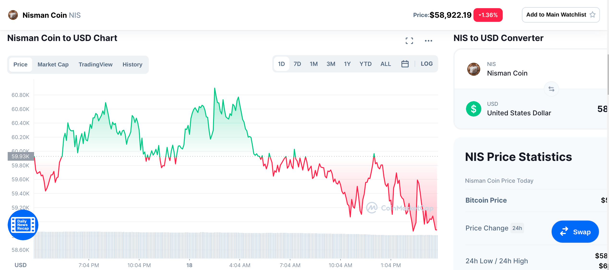

# Nisman Coin
Smart Contract running on the Ethereum network using Solidity.

<center>
	
</center>



## References
- [A Guide to Private Ethereum Mining with Geth (Go-Ethereum)](https://dev.to/heydamali/a-guide-to-private-ethereum-mining-with-geth-go-ethereum-13ol)
- [Deploy your first private Ethereum smart contract using Geth and Web3.js](https://medium.com/coinmonks/deploy-your-first-private-ethereum-smart-contract-using-geth-and-web3-js-2e495c1aadf4)
- [Using the Compiler](https://docs.soliditylang.org/en/v0.8.9/using-the-compiler.html)
- [web3.eth.Contract](https://web3js.readthedocs.io/en/v1.2.11/web3-eth-contract.html)
- [SPDX License List](https://spdx.org/licenses/)
- [Deploying Solidity Smart Contracts to Moonbeam Using Web3 and JavaScript](https://medium.com/moonbeam-network/using-the-ethereum-web3-library-to-deploy-smart-contracts-in-moonbeam-208006680341)
- [Solidity by Example](https://solidity-by-example.org/)
- [web3js-quorum](https://github.com/ConsenSys/web3js-quorum)
- [Canceling a pending transaction](https://ethereum.stackexchange.com/questions/9072/canceling-overwriting-a-pending-transaction-using-geth-json-rpc)
- [How do I sign transactions with Web3?](https://medium.com/finnovate-io/how-do-i-sign-transactions-with-web3-f90a853904a2)
- [web3.eth.personal](https://web3js.readthedocs.io/en/v1.2.7/web3-eth-personal.html#importrawkey)
- [gas required exceeds allowance or always failing transaction](https://ethereum.stackexchange.com/questions/80477/gas-required-exceeds-allowance-8000029-or-always-failing-transaction)
- [Writing Tests in Solidity](9https://www.trufflesuite.com/docs/truffle/testing/writing-tests-in-solidity)

## Installation
Geth is a command-line tool written in Go for creating a node and miners on a private chain.
```bash
sudo yum -y update
sudo dnf install snapd
sudo ln -s /var/lib/snapd/snap /snap
sudo snap install geth
npm install
``` 

## [Genesis Block](./genesis.json)
Every chain and network has a genesis block or the first block. This block does not have any parent and is the first block of the chain. A `genesis.json` file is required to create this first block.
```python
{
    "config": {
        # The Chain ID 1 represents a Homestead public network.
        # The Chain ID 2 represents Morden (not used anymore).
        # The chain ID 3 represents Ropsten.
        # The chain ID 4 represents Rinkeby.
        # Any chain ID above 4 represents a private network.
        "chainId": 152389429837498234,
        "homesteadBlock": 0,
        "eip155Block": 0,
        "eip158Block": 0
    },  
    "nonce": "0x0000000000000042",
    "timestamp": "0x0",
    "parentHash": "0x0000000000000000000000000000000000000000000000000000000000000000",
    "gasLimit": "0xffffffff",
    "difficulty": "0x200",
    "mixhash": "0x0000000000000000000000000000000000000000000000000000000000000000",
    "coinbase": "0x0000000000000000000000000000000000000000",
    "alloc": {}
}
```

## Starting a Geth node
```bash
npm run start
```
The preceding command runs as a service. Additional commands can not be executed through it. To manage existing running Geth nodes, open another terminal on the same computer and type:
```bash
npm run attach
```
Read the genesis block
```bash
eth.getBlock(0)
```

## Creating accounts
After connecting to a Geth node, it's sime to set up the coinbase or etherbase account. For this, a new account should be created first.
```bash
personal.newAccount()
```
This will return an Account ID such as:
```bash
0x2cd40613fea30b90e81980673ab1dc0f657ac88b
```
Creating a new account to receive transactions:
```bash
personal.newAccount()
```
Listing all accounts available.
```bash
eth.accounts
```
It will return the 2 created accounts:
```bash
["0x2cd40613fea30b90e81980673ab1dc0f657ac88b", "0x6b69c123392e0b4184e479b732b96ab9480f16a0"]
```

## Mining new tokens
Crypto currencies and blockchains in general allow you to work with arbitrarily many accounts at the same time. However often people want to have a default/primary account (e.g. miners have a designated mining address, average users will usually use one particular account even if they have multiple one for other purposes). [...] Coinbase or etherbase (they are the same thing) is just this. However to keep it simple and less surprising, your coinbase account is actually the first account in your keystore (i.e. in theory the first account you ever created).
```bash
miner.setEtherbase(eth.accounts[0])
```
With the `coinbase` set with a valid account and Geth node up and running, now mining can get started and, since we just have one miner, all rewards will go to this miner and its coinbase account will be credited with Ethers.
```bash
eth.coinbase
```
To begin mining on our private blockchain, we simply need to run:
```bash
miner.start()
```
If you aren't sure that your node is mining, please execute `eth.hashrate` to check, if the return value is greater than zero, it is mining, otherwise, it is not.
```bash
miner.getHashrate()
```
This command will return `true` if there is at least 1 active miner:
```
eth.mining
```
Get the latest mined block:
```bash
eth.getBlock("latest")
eth.getBlock("latest").number
```
Allow the miner to run for a while and then stop the process with:
```bash
miner.stop()
```
Notice that you’ve been rewarded with some tokens (depending on how long you left it running) for mining new blocks, this can be verified by checking the balance.
```bash
eth.getBalance(eth.accounts[0])
```
`geth` cannot provide any information about accounts or contracts until the sync is fully complete. When your sync is fully complete, syncing will return false, like:
```bash
eth.syncing
```

## Sending Tokens (Wei) from one account to another
By default, your accounts in Geth are "locked," which means that you can't send transactions from them. You need to unlock an account in order to send transactions from it through Geth directly or via RPC (though web3 does not support this). In order to unlock an account, you'll need to provide the password, which is used to decrypt the private key associated with your account, hence allowing you to sign transactions.
```bash
personal.unlockAccount(eth.accounts[0])
```
To transfer tokens, we simply use eth.sendTransaction() which accepts a bunch of parameters but most are optional and can be left out as reasonable defaults are used under the hood.
```bash
eth.sendTransaction({from: eth.accounts[0], to: eth.accounts[1], value: 1000})
```
At this point, the transaction has been created but has not been mined.
```bash
eth.pendingTransactions
```
Remember we ran miner.stop() just before creating this transaction, what happens under the hood is that this transaction is added to the mempool (queue) of transactions waiting to be added to a block by a miner, and given that we are the only miners on this network, we will have to mine this transaction ourselves
```bash
miner.start()
```
Give it a couple of seconds then run:
```bash
miner.stop()
```
You can verify that some tokens were sent to the receiving account by running:
```bash
eth.getBalance(eth.accounts[0])
eth.getBalance(eth.accounts[1])
```

## Importing an existing Wallet
Imports the given private key into the key store, encrypting it with the passphrase.
```bash
personal.importRawKey('private-key', 'encryption-password')
```
Check the account has been imported:
```bash
eth.accounts[eth.accounts.length - 1]
```
Add some tokens to the recently added account.
```bash
miner.setEtherbase(eth.accounts[eth.accounts.length - 1])
```
Start mining some blocks.
```bash
miner.start()
```
Wait for some blocks to be added to the Blockchain and stop the worker.
```bash
miner.stop()
```
Fetch the balance of the new account:
```bash
eth.getBalance(eth.accounts[eth.accounts.length - 1])
```

## Transferring Ether between accounts.
Before transfering Ether, the account must be unlocked:
```bash
personal.unlockAccount(eth.accounts[0])
```
Transfer Ether from the miner to the seconary account:
```bash
node run send
```
At this point, the transaction should be pending:
```bash
eth.pendingTransactions
```
Start the miner so that the transaction is processed:
```bash
miner.start()
```
Give it a couple of seconds then run:
```bash
miner.stop()
```
List the balance of all the accounts:
```bash
Balance: 0 0x3dbc3f8DF17dc60F27494b53dc91150289D9f61c 5789998386453999997000
Balance: 1 0x7950880AE32E0E1A64e42b4E9EDd43057A33f443 2000
```

## Deploying a Smart Contract
Deploying a contract requires unlocking an account.
```bash
personal.unlockAccount(eth.accounts[0])
```
Compiling and deploying the contract using web3.js:
```bash
npm run deploy
```
At this point, the transaction has been created but has not been mined.
```bash
eth.pendingTransactions
```
Start the miner so that the transaction that deploys the Contract is added to the Blockchain.
```bash
miner.start()
```
Give it a couple of seconds then run:
```bash
miner.stop()
```
The address of the contract is stored in `token.txt`.
```bash
cat token.txt
```

## Interacting with the Contract
Reading data does not require gas:
```bash
npm run balance
```
```bash
Gas Price: 1000000000
Estimated Gas: 21782
Current Killer: 0x3dbc3f8DF17dc60F27494b53dc91150289D9f61c
Contract Balance: 2000
Balance: 0 0x3dbc3f8DF17dc60F27494b53dc91150289D9f61c Kills: 0 Balance: 5789996429870997960000
Balance: 1 0x7950880AE32E0E1A64e42b4E9EDd43057A33f443 Kills: 1 Balance: 34999977320002037000
```
For updating the state of the Contract, an account must be unlocked:
```bash
personal.unlockAccount(eth.accounts[0])
```
Now, the state of the contract can be updated:
```bash
npm run update
```
At this point, the transaction should be pending:
```bash
eth.pendingTransactions
```
Start the miner so that the transaction is processed:
```bash
miner.start()
```
Give it a couple of seconds then run:
```bash
miner.stop()
```
Now check the balance again:
```bash
Gas Price: 1000000000
Estimated Gas: 21782
Current Killer: 0x7950880AE32E0E1A64e42b4E9EDd43057A33f443
Contract Balance: 0
Balance: 0 0x3dbc3f8DF17dc60F27494b53dc91150289D9f61c Kills: 1 Balance: 5789996364575997957000
Balance: 1 0x7950880AE32E0E1A64e42b4E9EDd43057A33f443 Kills: 2 Balance: 34999866742002042000
```

## Cancelling a pending transaction
Canceling a transaction requires unlocking your private key.
```bash
personal.unlockAccount(eth.accounts[0])
```
Send a new transaction with the same nonce but with a higher gas price.
```bash
eth.sendTransaction({
	from: eth.coinbase,
	to: eth.coinbase,
	value: 0,
	gasPrice: 4234545335244,
	gasLimit: 44000,
	nonce: eth.pendingTransactions[0].nonce
});
```

## Testing the Contract
Run unit tests
```bash
npm run test
```
